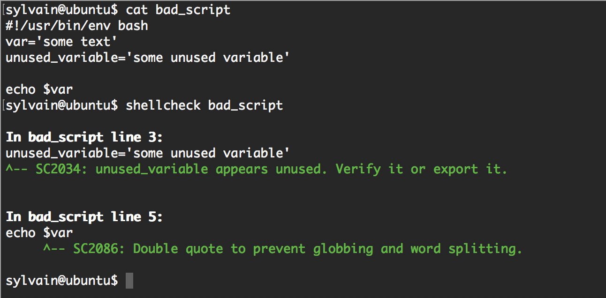

# 0x04. Loops, conditions and parsing

- DevOps
- Shell
- Bash
- Scripting
- Conditional expressions
- Loop control variables
- Parsing input

## Objectives

1. Understand how to use loops in bash scripting
2. Use conditional expressions to make decisions within scripts
3. Learn about loop control variables and how they can be used with loops
4. Develop an understanding of how to parse command line arguments using the "$@" variable
5. Write a simple bash script that demonstrates these concepts

