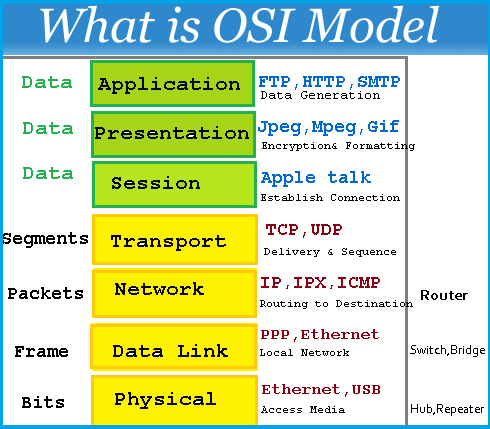

# 0x07. Networking basics #0

 

## Introduction to networking

Networks are a collection of devices that communicate with each other through a shared medium, such as
cables or wireless signals. They allow different systems to work together and share resources, such as data
and services. In this module we will explore the basic concepts and components of networks: nodes, links
(devices), communication protocols, network topologies, and packet switching vs. circuit switching.
**Agenda**

* Overview of networking
* Components of networks
* Communication Protocols
* TCP/IP model
* Packet Switching vs Circuit Switching
